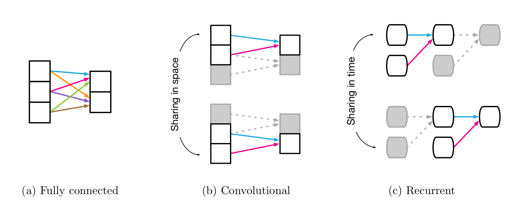

# Introdução
**	**

Inteligência Artificial vem passando por uma renascença com grande progresso em visão, linguagem, controle e decisões [1]. Desde 1986 [2] e principalmente a partir de 2006 [3], Redes Neurais Artificiais começaram a se destacar junto com variações como Redes Neurais Convolucionais (CNNs) e Redes Neurais Recorrentes (RNNs).

**Fig. 1: Representação simplificada de alguns modelos de redes neurais [1]**

Recentemente, entre 2017 e 2018, foram publicados os artigos [1],[6],[7] que descrevem algoritmos de predição de grafos generalizados, podendo assim prever, com dada margem de erro, grafos de saída dados grafos de entrada. Isso permitiria aproximar a solução de problemas em variadas áreas, incluindo química molecular, mecânica corpuscular, genética e estudo de comunidades.

Em 2 de Janeiro de 2019, foi feita uma revisão dos principais algoritmos de aprendizagem para a resolução do problema em questão [4]. Essa revisão aborda os três algoritmos citados em [1],[6],[7]. Testes iniciais, motivados pela banca orientadora, indicam a possibilidade de haver uma restrição computacional na generalização desses algoritmos preditivos. 

A hipótese é que existem limitações nesses algoritmos por causa da simplificação na representação dos grafos. Grafos são estruturas invariantes a permutações de vértices e todos as técnicas citadas usam conjuntos de treinamentos que não consideram todas as permutações possíveis, porque isso seria impraticável já que o tempo de treino seria fatorial no número de vértices, o que é chamado de explosão combinatória. Para melhor compreender as limitações desses algoritmos mencionados, estes serão avaliados em três datasets diferentes com a finalidade de mapear restrições e possíveis melhorias. 

Baseando-se na análise dos experimentos, serão propostos métodos para amenizar o problema que não envolvam o treinamento em todas as permutações dos vértices, o que limitaria os algoritmos em aplicações de entradas pequenas, por conta da explosão combinatória.

Um método que já está sendo hipotetizado para mitigar as limitações é aumentar seletivamente o conjunto de treino para lidar com permutações específicas, que produzam maiores erros na função de avaliação do algoritmo. Apesar da hipótese de melhoria, este trabalho de análise será exploratório, portanto novas estratégias podem surgir a depender dos resultados dos experimentos e do trabalho de pesquisa em torno destes.

## Referências

[[1]](https://arxiv.org/abs/1806.01261) Battaglia et al, "Relational inductive biases, deep learning, and graph networks", arXiv:1806.01261v3, 2018-10-17 

[[2]](http://www.cs.toronto.edu/~fritz/absps/pdp8.pdf) D. E. Rumelhart, G. E. Hinton, R.J. Williams, "Learning Internal Representations by Error Propagation", p. 317, 1986 

[[3]](http://www.cs.toronto.edu/~hinton/absps/fastnc.pdf) G. E. Hinton, S. Osindero, Y. W. Teh, "A fast learning algorithm for deep belief nets", Neural Computation, vol. 18, 2006

[[4]](https://arxiv.org/abs/1812.08434v2) J. Zhou, et al "Graph Neural Networks: A Review of Methods and Applications", arXiv:1812.08434v2, 2019-01-02

[[5]](https://arxiv.org/abs/1810.00826) K. Xu, W. Hu, J. Leskovec, S. Jegelka, "How Powerful are Graph Neural Networks?", arXiv:1810.00826, 2018

[[6]](https://arxiv.org/abs/1704.01212) J. Gilmer, et al "Neural message passing for quantum chemistry", arXiv:1704.01212v2, 2017-06-12

[[7]](https://arxiv.org/abs/1711.07971) X. Wang, R. Girshick, A. Gupta, and K. He, "Non-local neural networks", arXiv:1711.07971v3, 2018-04-13

# Cronograma

**	**

## [Cronograma sugerido](https://docs.google.com/spreadsheets/d/1K8QQMMGayemuGdU6l-k3yffjdm1wEUiL7jPBEiibLCw/edit#gid=0):

1. Estudo inicial (3 semanas)
    1. Leitura bibliográfica
    2. Exploração da Ferramenta: Salvar e ler dados remotos
    3. Exploração dos datasets: Implementar encoder e decoder para network
    4. Exploração de implementações de protótipos de framework para diferentes algoritmos e modificá-los para aceitarem outros datasets
2. Setup de pipeline e Treinamento (2 semanas)
    1. Preparar implementações para rodar em um servidor: Configurar um servidor remoto ou um dock com o mínimo para executar os algoritmos da etapa anterior
    2. Adaptar o script para rodar no servidor
    3. Treinar e salvar gradientes: Configurar o treino para salvar checkpoints em nuvem e localmente
3. Teste e Análise (4 semanas)
    1. Estudar permutações a serem realizadas nos dados, se alguma eliminação ou inferência pode ser feita a partir da semântica dos dados: Mostrar e tirar dúvidas
    2. Executar testes: Usando os gradientes de 2.3, testar em uma parte do conjunto de testes para entender os problemas
    3.  Análise exploratória dos resultados: Estudar permutações a serem realizadas nos dados, se alguma eliminação ou inferência pode ser feita considerando os resultados anteriores
    4.  Executar algoritmos com permutações no conjunto de teste para avaliar o efeito que permutações dos vértices na entrada do conjunto de teste tem na saída da rede treinada em 2.3
    5.  Analisar quais permutações são piores para o desempenho da rede: Propor e aplicar métricas e avaliá-las nos resultados dos testes em 3.4
4. Selective Augmentation (4 semanas)
    1.  Estudar estratégias de aumentação (augmentation) em grafos que já existam na literatura considerando os resultados de testes já feitos até o momento. 
    2.  Propor aumentação no conjunto de treino com base nas análise: Com base nos estudos realizados anteriormente, propor e implementar alguma forma de aumentação seletiva, isto é, que leve em consideração todo o conhecimento adquirido até o momento evitando a explosão combinatória
5. Validar proposta (3 semanas)
    1.  Retreinar a rede usando as propostas e estratégias implementadas
    2.  Analisar os resultados após a estratégia ter sido aplicada e comparar com resultados anteriores para estimar o ganho de eficiência da estratégia implementada

Observação: Cada aluno implementará uma versão para um dataset diferente. O que puder ser utilizado por todos será dividido.

<table>
<tr>
    <td colspan="3" >>
Mês
</td>
    <td>Fevereiro</td>
    <td colspan="5" >Março</td>
    <td colspan="4" >Abril</td>
    <td colspan="4" >Maio</td>
    <td colspan="2" >Junho</td>
</tr>
<tr>
    <td colspan="3" >>
Semana
</td>
    <td>1</td>
    <td>2</td>
    <td>3</td>
    <td>4</td>
    <td>5</td>
    <td>6</td>
    <td>7</td>
    <td>8</td>
    <td>9</td>
    <td>10</td>
    <td>11</td>
    <td>12</td>
    <td>13</td>
    <td>14</td>
    <td>15</td>
    <td>16</td>
  </tr>
  <tr>
   <td rowspan="4" >>Estudo inicial</td>
   <td>1.1</td>
   <td>

Leitura Bibliográfica

</td>
   <td>x</td>
   <td>x</td>
   <td>x</td>
   <td></td>
   <td></td>
   <td></td>
   <td></td>
   <td></td>
   <td></td>
   <td></td>
   <td></td>
   <td></td>
   <td></td>
   <td></td>
   <td></td>
   <td></td>
  </tr>
  <tr>
   <td>1.2</td>
   <td>

Exploração da ferramenta

</td>
   <td>x</td>
   <td>x</td>
   <td></td>
   <td></td>
   <td></td>
   <td></td>
   <td></td>
   <td></td>
   <td></td>
   <td></td>
   <td></td>
   <td></td>
   <td></td>
   <td></td>
   <td></td>
   <td></td>
  </tr>
  <tr>
   <td>1.3</td>
   <td>

Exploração dos datasets

</td>
   <td></td>
   <td>x</td>
   <td>x</td>
   <td></td>
   <td></td>
   <td></td>
   <td></td>
   <td></td>
   <td></td>
   <td></td>
   <td></td>
   <td></td>
   <td></td>
   <td></td>
   <td></td>
   <td></td>
  </tr>
  <tr>
   <td>1.4</td>
   <td>

Exploração de implementações

</td>
   <td></td>
   <td>x</td>
   <td>x</td>
   <td></td>
   <td></td>
   <td></td>
   <td></td>
   <td></td>
   <td></td>
   <td></td>
   <td></td>
   <td></td>
   <td></td>
   <td></td>
   <td></td>
   <td></td>
  </tr>
  <tr>
   <td rowspan="3" >>Setup e Treino</td>
   <td>2.1</td>
   <td>

Preparar servidor

</td>
   <td></td>
   <td></td>
   <td></td>
   <td>x</td>
   <td></td>
   <td></td>
   <td></td>
   <td></td>
   <td></td>
   <td></td>
   <td></td>
   <td></td>
   <td></td>
   <td></td>
   <td></td>
   <td></td>
  </tr>
  <tr>
   <td>2.2</td>
   <td>

Adaptar o script

</td>
   <td></td>
   <td></td>
   <td></td>
   <td>x</td>
   <td>x</td>
   <td></td>
   <td></td>
   <td></td>
   <td></td>
   <td></td>
   <td></td>
   <td></td>
   <td></td>
   <td></td>
   <td></td>
   <td></td>
  </tr>
  <tr>
   <td>2.3</td>
   <td>

Treinar salvando gradientes

</td>
   <td></td>
   <td></td>
   <td></td>
   <td></td>
   <td>x</td>
   <td>x</td>
   <td></td>
   <td></td>
   <td></td>
   <td></td>
   <td></td>
   <td></td>
   <td></td>
   <td></td>
   <td></td>
   <td></td>
  </tr>
  <tr>
   <td rowspan="5" >>Testes e Análise</td>
   <td>3.1</td>
   <td>

Estudar permutações

</td>
   <td></td>
   <td></td>
   <td></td>
   <td></td>
   <td></td>
   <td>x</td>
   <td>x</td>
   <td></td>
   <td></td>
   <td></td>
   <td></td>
   <td></td>
   <td></td>
   <td></td>
   <td></td>
   <td></td>
  </tr>
  <tr>
   <td>3.2</td>
   <td>

Testar uma parte

</td>
   <td></td>
   <td></td>
   <td></td>
   <td></td>
   <td></td>
   <td></td>
   <td>x</td>
   <td>x</td>
   <td></td>
   <td></td>
   <td></td>
   <td></td>
   <td></td>
   <td></td>
   <td></td>
   <td></td>
  </tr>
  <tr>
   <td>3.3</td>
   <td>

Análise Exploratória

</td>
   <td></td>
   <td></td>
   <td></td>
   <td></td>
   <td></td>
   <td></td>
   <td>x</td>
   <td>x</td>
   <td></td>
   <td></td>
   <td></td>
   <td></td>
   <td></td>
   <td></td>
   <td></td>
   <td></td>
  </tr>
  <tr>
   <td>3.4</td>
   <td>

Testar com permutações

</td>
   <td></td>
   <td></td>
   <td></td>
   <td></td>
   <td></td>
   <td></td>
   <td></td>
   <td>x</td>
   <td>x</td>
   <td></td>
   <td></td>
   <td></td>
   <td></td>
   <td></td>
   <td></td>
   <td></td>
  </tr>
  <tr>
   <td>3.5</td>
   <td>

Análise de 3.4

</td>
   <td></td>
   <td></td>
   <td></td>
   <td></td>
   <td></td>
   <td></td>
   <td></td>
   <td></td>
   <td>x</td>
   <td></td>
   <td></td>
   <td></td>
   <td></td>
   <td></td>
   <td></td>
   <td></td>
  </tr>
  <tr>
   <td rowspan="2" >>Aumentação</td>
   <td>4.1</td>
   <td>

Estudar Aumentação

</td>
   <td></td>
   <td></td>
   <td></td>
   <td></td>
   <td></td>
   <td></td>
   <td></td>
   <td></td>
   <td></td>
   <td>x</td>
   <td>x</td>
   <td>x</td>
   <td></td>
   <td></td>
   <td></td>
   <td></td>
  </tr>
  <tr>
   <td>4.2</td>
   <td>

Propor Aumentação seletiva

</td>
   <td></td>
   <td></td>
   <td></td>
   <td></td>
   <td></td>
   <td></td>
   <td></td>
   <td></td>
   <td></td>
   <td></td>
   <td></td>
   <td>x</td>
   <td>x</td>
   <td></td>
   <td></td>
   <td></td>
  </tr>
  <tr>
   <td rowspan="2" >>Validação</td>
   <td>5.1</td>
   <td>

Retreinar

</td>
   <td></td>
   <td></td>
   <td></td>
   <td></td>
   <td></td>
   <td></td>
   <td></td>
   <td></td>
   <td></td>
   <td></td>
   <td></td>
   <td></td>
   <td></td>
   <td>x</td>
   <td>x</td>
   <td></td>
  </tr>
  <tr>
   <td>5.2</td>
   <td>

Analisar

</td>
   <td></td>
   <td></td>
   <td></td>
   <td></td>
   <td></td>
   <td></td>
   <td></td>
   <td></td>
   <td></td>
   <td></td>
   <td></td>
   <td></td>
   <td></td>
   <td></td>
   <td>x</td>
   <td>x</td>
  </tr>
</table>

<!-- Docs to Markdown version 1.0β15 -->
