### Synthetic Graph Datasets

#### 3D Surface Dataset
It is a collection of the following 3D functions: **torus**, **elliptic paraboloid**, **saddle**, **ellipsoid**, **elliptic hyperboloid**, **another**.
Where we use different geometric transformations(scale, translate, rotate, reflex, shear) to give variability to the samples.
It is possible to change the number of point by surface, the number or type of functions.

<table>
  <tr>
    <th>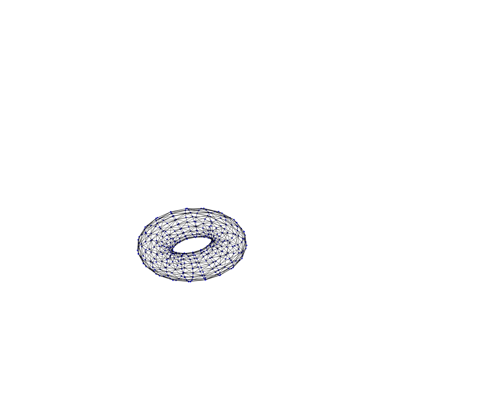</th>
    <th>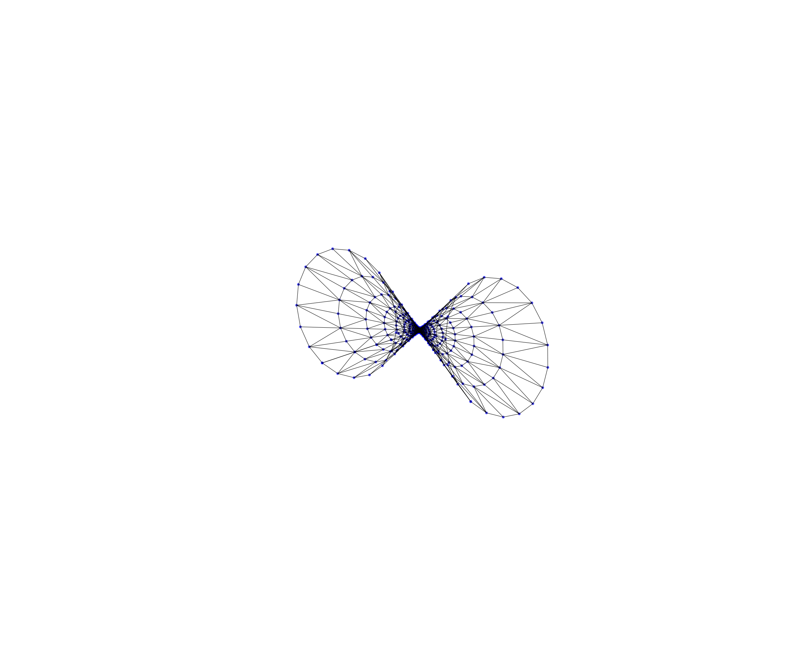</th>
    <th>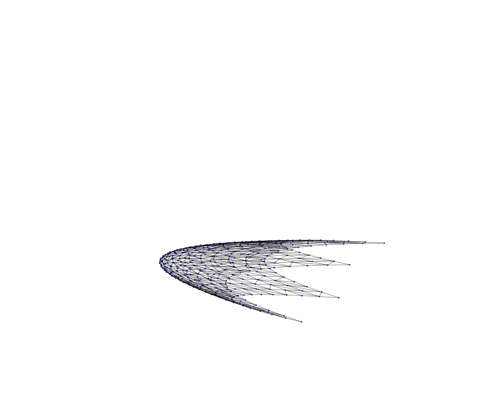</th>
  </tr>
  <tr>
    <td>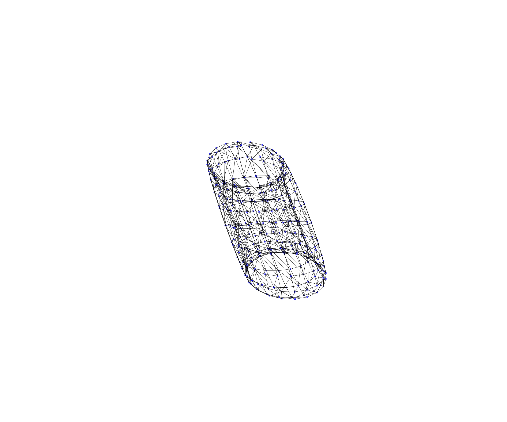</td>
    <td>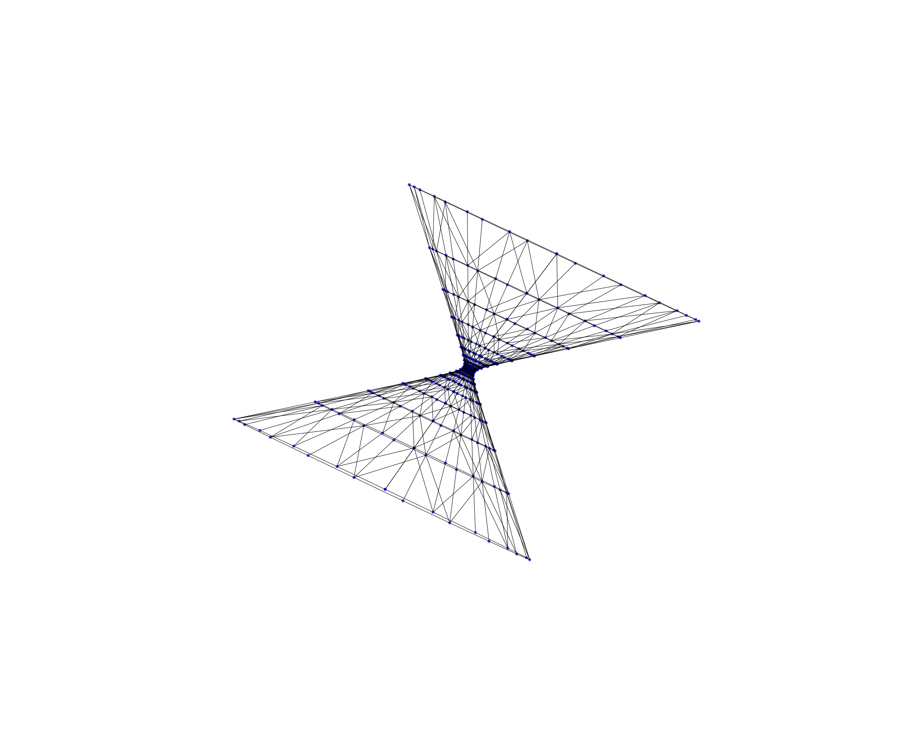</td>
    <td>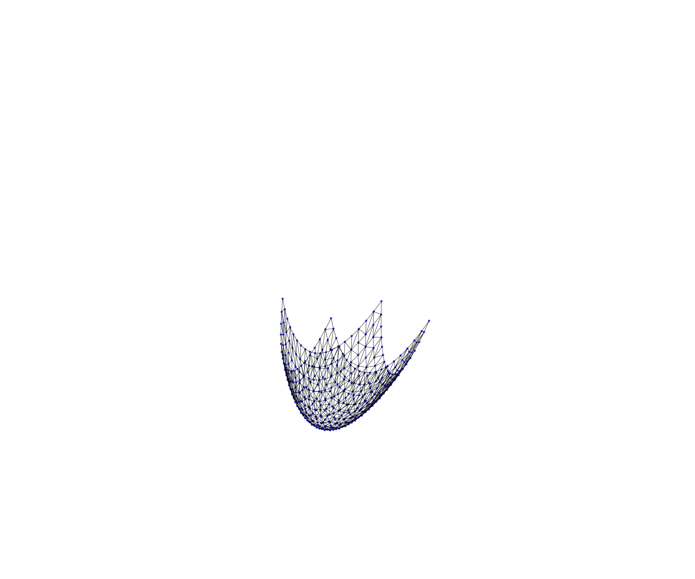</td>
  </tr>
</table>

The code is show in `graph_surface_dataset.py`. For show the samples run `test_create_surface()` function.
For feed your network use `test_batch_gen()` which show an example for do it using generators by batch.

#### Community Dataset
This dataset presents the following samples: **2-communities** and **4-communities**.
It is possible to change the number of individuals by community.

<table>
  <tr>
    <th>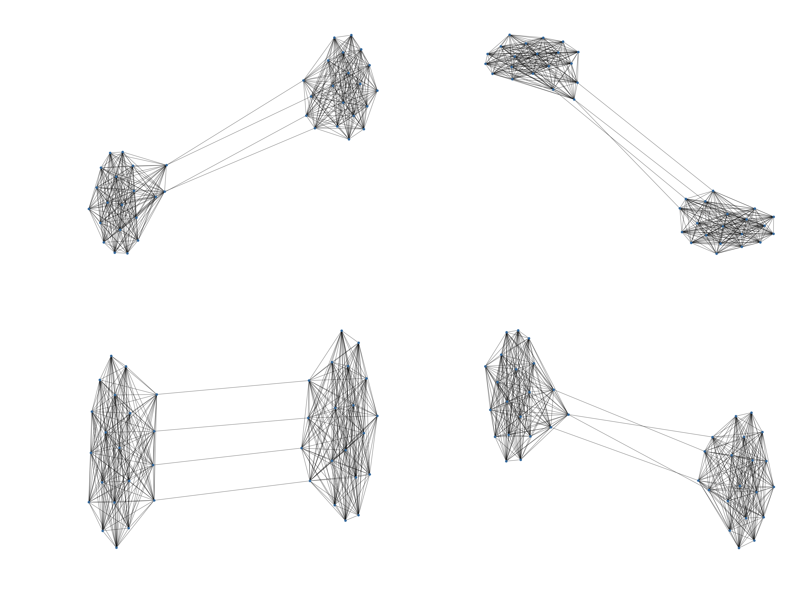</th>
    <th>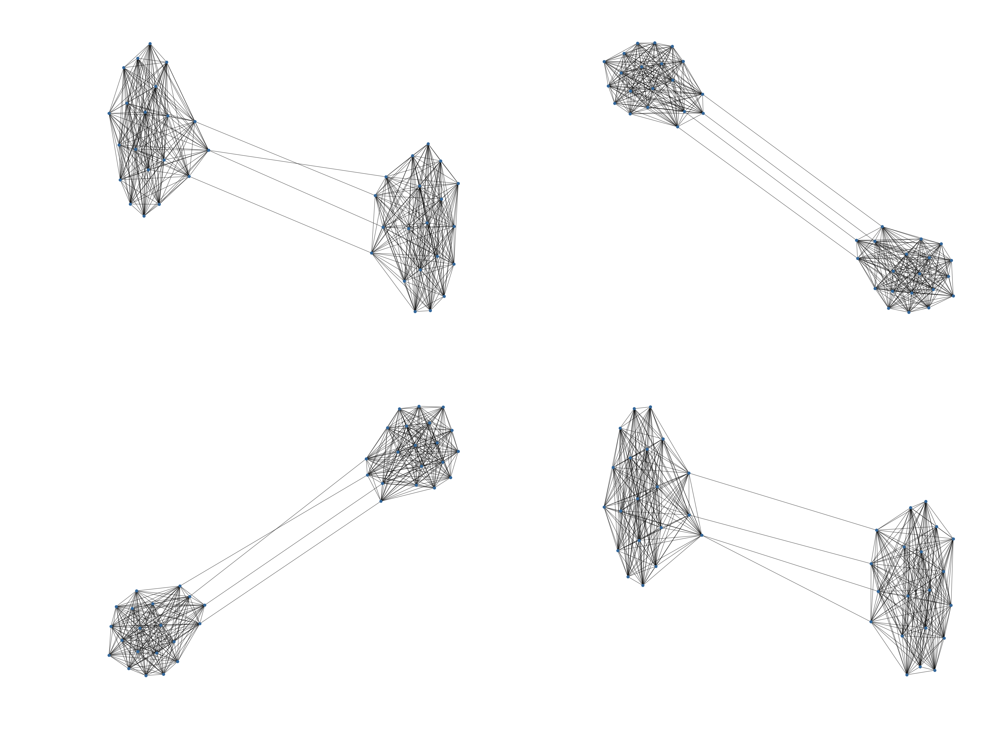</th>
    <th>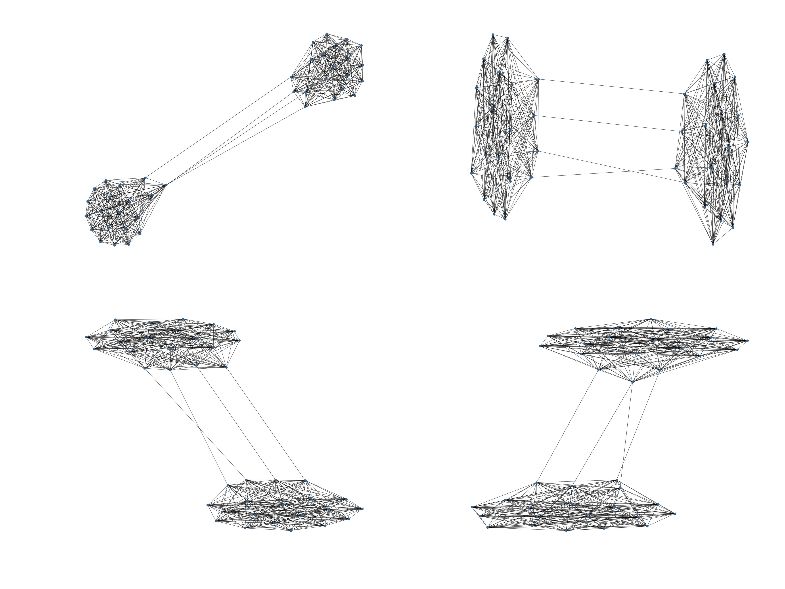</th>
  </tr>
  <tr>
    <td>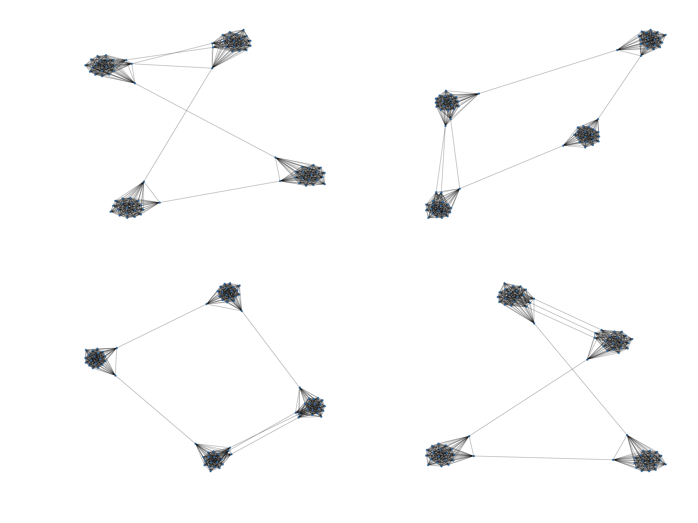</td>
    <td>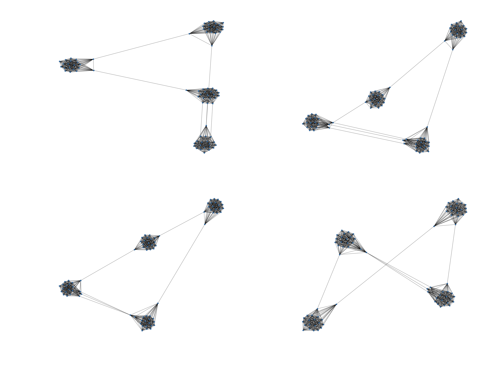</td>
    <td>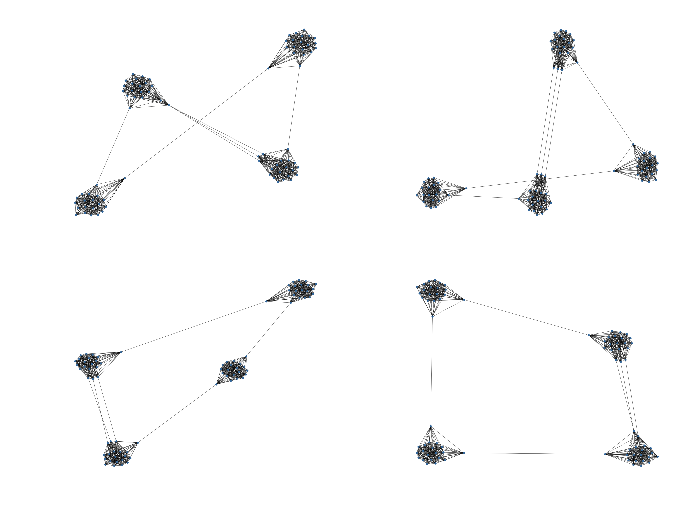</td>
  </tr>
</table>

The code is show in `graph_communty_dataset.py`. For show the samples run `test_create_community()` function.
For feed your network use `test_batch_gen()` which show an example for do it using generators by batch.

Note: both datasets created graphs with permutations, besides, the number of permutation by graphs is variable.
